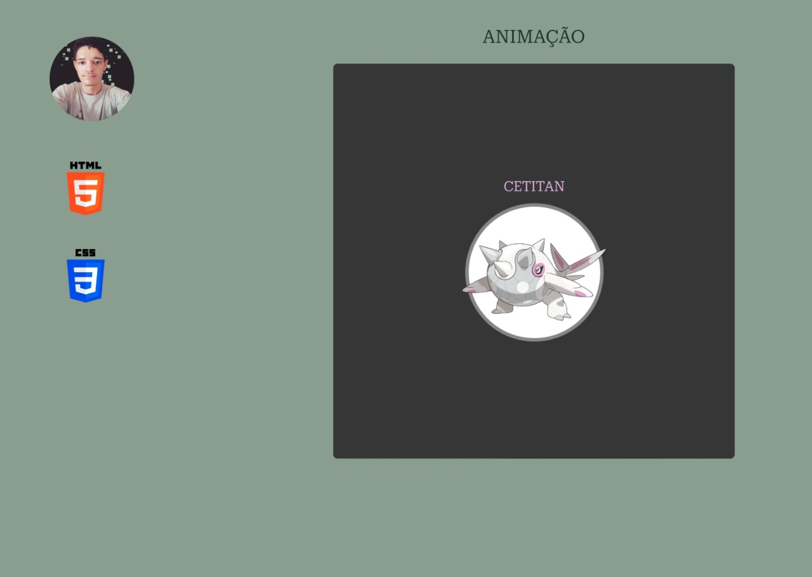

<h1 align="center"> YOUTUBE-PROJECTS  </h1>

Desenvolvidor por willian glitch afins compartilhar e aprender sobre o mundo da programação.

  <a href="#-tecnologias">Tecnologias</a>&nbsp;&nbsp;&nbsp;|&nbsp;&nbsp;&nbsp;
  <a href="#-projeto">Projeto</a>&nbsp;&nbsp;&nbsp;|&nbsp;&nbsp;&nbsp;
  <a href="#memo-licença">Licença</a>

  

 

  

 

## 🚀 Tecnologias

Esse projeto foi desenvolvido com as seguintes tecnologias:

- HTML
- CSS
- Git e GitHub

 

## 💻 Projeto

Animação-giro-pokemon-cetitan é um projeto simples que demonstrar como fazer uma animação simples .

[🔗 Acesse aqui](https://tourmaline-heliotrope-460145.netlify.app)

## :memo: Licença

Esse projeto está sob a licença MIT.

---

Feito by willianglitch :wave: [LinkedIn](https://www.linkedin.com/in/willianglitchprogramador/)
